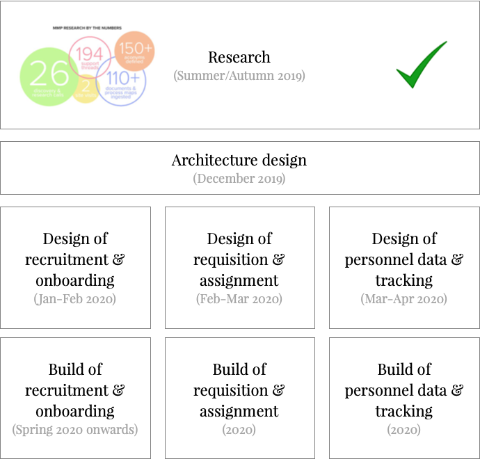

# Research findings

    

    

        
    

    

        
    

    

        
    

    

        
    

    

        
    

> **Note** — This research is _not_ for consumption by broad groups within AIM. early on during the design phase we will be creating presentable artefacts which can be shared and which we will use when speaking to regions about our recommendations. please do not share this page.

Dear Walt, Karen et al.

We've now completed the research phase of the MMP project according to the agreed [research design](https://docs.google.com/document/d/1NZ3Qt0jCcgJwYiOkhZZ7TL5R1t3wTXmdRlqLZJX_Pzk/edit?usp=sharing). This page indexes the various documents and diagrams which represent what we've seen and heard. The majority of the links are to living documents which are and will continue to be iterated and adjusted as we continue through the MMP project phases.

## What's next

The first thing we'll do in the design phase (in late-Dec/early-Jan) is to extract from our research the areas of functionality that the new MMP system(s) _could_ cover, format and package them in an easy to understand and summarised way, and then present them to you (and, later, the rest of AIM) to start the conversation about what the MMP should include in its scope. This will expand on and refine the research documents below, especially the [scenarios & use-cases](https://docs.google.com/document/d/1X1d97bUGy89gwhAcCkFMk2mLdx6zH8BdKfh3_0GwVu0/edit?usp=sharing) and [identified issues](https://docs.google.com/document/d/1-GMCG42ZAG0OrBRfSEZMZZZPhlq2PakwNnnRaNS-D3M/edit?usp=sharing) — this is really just a process of doing a final, fine-grained pass through our research to find any areas of broad functionality we may have missed from those documents since we've been doing this as we go along and noting our thoughts in the two documents above.

At the same time, we'll come up with a proposed high level architecture, outlining the areas of functionality the MMP will need to fulfil AIM's needs, based on our interpretation of the research. This will give us something tangible to start presenting for early feedback and to prompt scoping and early roll-out planning conversations.

We'll gather this early feedback from regions ASAP (late-Dec/early-Jan) so we can get buy-in and agreement with this high level architecture and overall approach to allow detailed design work to begin without risk of the system approach being rejected at the 11th hour.

The aforementioned scoping conversations will happen _in parallel_ with the early parts of the design phase but we will push to have these conversations quite early on as they will have significant implications — for example, when designing the recruitment & onboarding area we will need to make decisions with MRs about whether their existing CRM systems (eg, ThankQ for EU, ACT  for US, Trello for SA) should stay in place or not.

Once the scope of the MMP is decided we'll begin technology platform selection and more detailed design work.

## What you should do now

At this point, please review the research below to check for any misunderstandings, errors or omissions.

- - -

> **Note** — This research is _not_ for consumption by broad groups within AIM. early on during the design phase we will be creating presentable artefacts which can be shared and which we will use when speaking to regions about our recommendations. please do not share this page.

- [**Scenarios & use-cases →**](https://docs.google.com/document/d/1X1d97bUGy89gwhAcCkFMk2mLdx6zH8BdKfh3_0GwVu0/edit?usp=sharing)

    This outlines the high level scenarios that the MMP will need to address and providing richer, narrative information that compliments detailed process information (which you can find in the [process maps](https://drive.google.com/file/d/1RN3G5ILvl0AlOo9-S4F1-_G4g_RqE6dp/view?usp=sharing)).

    You can find more details about how we've used this document [here](research-ingestion.md#scenarios-use-cases).

- [**Identified issues →**](https://docs.google.com/document/d/1-GMCG42ZAG0OrBRfSEZMZZZPhlq2PakwNnnRaNS-D3M/edit?usp=sharing)

    This document the high level problems that will need addressing with the MMP and obvious areas of focus for the design phase to explore as part of the aforementioned work to define the project scope.

- [**Areas requiring clarity →**](https://docs.google.com/document/d/1C_LD9rHH9f7ZKXAA59ywybvlhYNc0puY1bkwH0rZgFI/edit#)

    This document outlines some areas of clarity we'll need during the project. For example, _'such and such an IO policy is ambiguous and will need adjusting before we implement the MMP_', or _'regions have different interpretations of policy X'_, or _'everyone ignores policy Y and does this instead'_.

- [**Feature capture document →**](https://docs.google.com/document/d/1rbnvLaqszc3ksgsomIMEtMtTEFTTtOF2erGqeAlcYxc/edit?usp=sharing)

    This document is a mixture of team-identified requirements (ie, things that Suru, Ted or Lisa have spotted during the research which the MMP might need to cover) and specific requests from AIM people (either emailed into the MMP project team or raised during research sessions). A number of items from this document will, during the the design phase, be extracted into the summary mentioned above of possible areas of functionality of the MMP. Some of these are quite detailed features which you won't see highlighted in our early design phase work — we need to get broad alignment on approach and the MMP's 'shape' before we start discussing very specific features.

    You can find more details about how we've used this document [here](research-ingestion.md#featuresrequests).

- [**Process maps →**](https://drive.google.com/file/d/1RN3G5ILvl0AlOo9-S4F1-_G4g_RqE6dp/view?usp=sharing)

- [**Glossary, language, acronyms & terminology →**](https://docs.google.com/document/d/1wuEm8gkef-zeJGocQkpzqhdyBGx1bILJAdyKkCaU8AU/edit?usp=sharing)

- [**Reporting requirements →**](https://docs.google.com/spreadsheets/d/1EYZW77dfAvrHQhu8jfpJhBODydfTVN7cOkpRf_EGd6g/edit?usp=sharing)

- [**Regions & departments**](https://docs.google.com/document/d/1KM00UshaJcpiRaavfxQ5_LqSpanfIWJbOVEbCmQf0qs/edit?usp=sharing) (and [accompanying map](https://drive.google.com/file/d/1RMu31uggu1g_yf7xvjMPnUxivsaxvbe0/view?usp=sharing))

- [**AIM people →**](https://docs.google.com/spreadsheets/d/1KB1yPFKKnyGADe6ISD-qUKqbhS0tQtiJrvH3Umdf4E8/edit?usp=sharing)

- [**Detailed index of documents and raw research notes →**](https://docs.google.com/spreadsheets/d/1no_a6I-j8D7p-iOv2Ozc0ALKWmjrXL4-WbNb723KBPQ/edit?usp=sharing)
